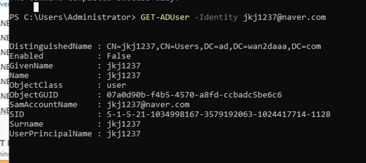

## AD Powershell script 
[MS AD WindowsServer2022](https://learn.microsoft.com/en-us/powershell/module/activedirectory/?view=windowsserver2022-ps)

- 유저 찾기
```shell
GET-ADUser -Identity Administrator
```

- base DN 찾기
```shell
(Get-ADDomain).DistinguishedName
```

- userAccountControl 은 생성 후 추가
512 = Enabled
514 = Disabled
66048 = Enabled, password never expires
66050 = Disabled, password never expires

- userAccountControl은 생성시 삽입이 안되는가보당... 
  - 정책을 설정해서 기본으로 Enabled로 바꿔서 처리하자

- LDAP attribute List

[attribute list](https://documentation.sailpoint.com/connectors/active_directory/help/integrating_active_directory/ldap_names.html)

- AD UserAccountControl
[AD UserAccountControl properties](https://learn.microsoft.com/en-us/troubleshoot/windows-server/active-directory/useraccountcontrol-manipulate-account-properties)

- LDAP account type
[LDAP account type](https://www.ldap-account-manager.org/lamcms/supportedTypes)

